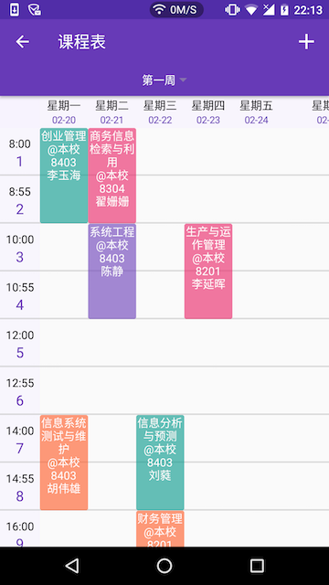
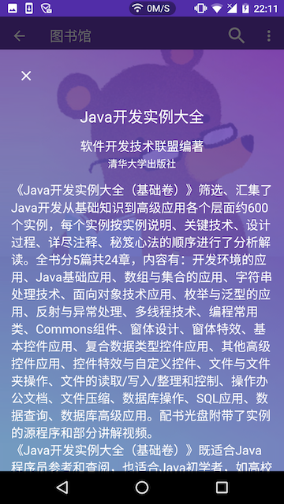

# 华师匣子

> 口袋里的华师

由木犀团队为华师学子倾力打造的校园通 App。  
目前一版已上线，二版预计3月初上线。  

## 编译环境：
- **compileSdkVersion**: 27
- **Android Gradle plugin version** :3.3.2  
- **buildToolsVersion** :28.0.3
- **Java version** :java1.8   
- **Gradle version**:4.10.1+  
- **instant run**:unenable(due to tinker)   

- 注:其中gradle-wrapper中`distributionUrl=https\://services.gradle.org/distributions/gradle-4.10.1-all.zip`指定为gradle4.10.1

## 功能介绍：  
- [课程表]查看课表、添加课程  
- [图书馆]搜索图书、查看已借图书信息  
- [学生卡]查看学生卡余额  
- [成绩查询]查询考试成绩  
- [电费查询]查询寝室电费  
- [部门信息]查看各部门办公信息  
- [通知公告]查看学校通知信息  
- [消息提醒]课程提醒、新成绩提醒、图书提醒以及学生卡余额提醒  
- [校历查询]查询学校校历  
- [地图]查询校内精确地点，地点图片，描述介绍，华师特制
## 应用下载

[下载官网](https://ccnubox.muxixyz.com/)  
[豌豆荚下载](http://www.wandoujia.com/apps/net.muxi.huashiapp)

## 应用截图
### 一版
    
  

### 二版

 
 

## Thanks
[Fresco](https://github.com/facebook/fresco)  
[Retrofit](https://github.com/square/retrofit)  
[RxJava](https://github.com/ReactiveX/RxJava)  
[Butter Knife](https://github.com/JakeWharton/butterknife)

### 华中师范大学[木犀团队](http://muxistudio.com/)出品

